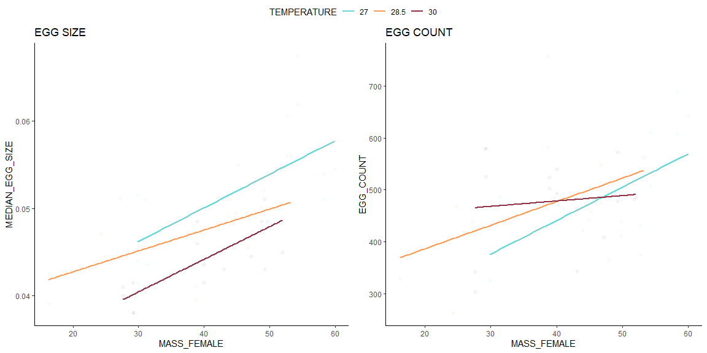
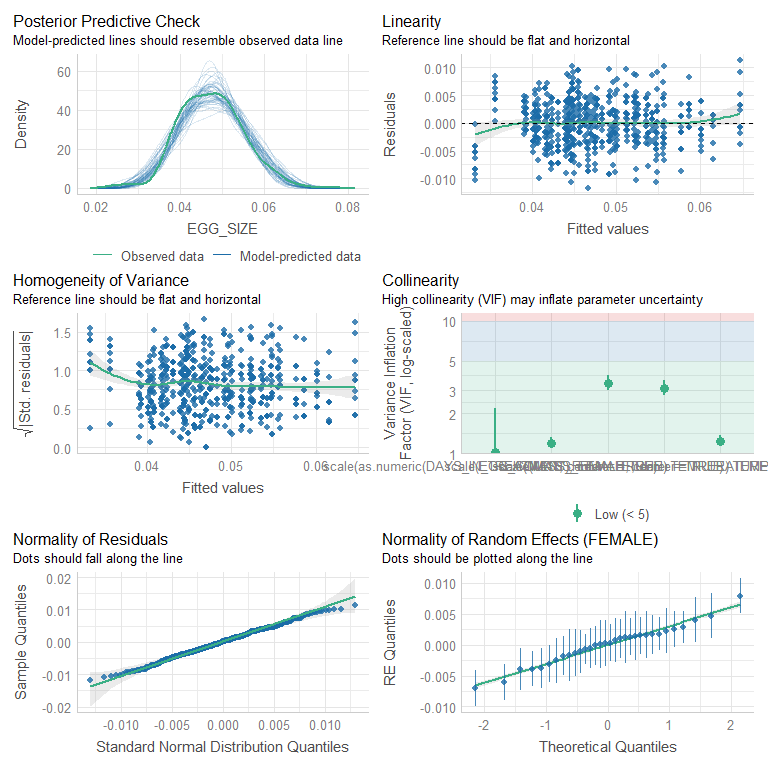
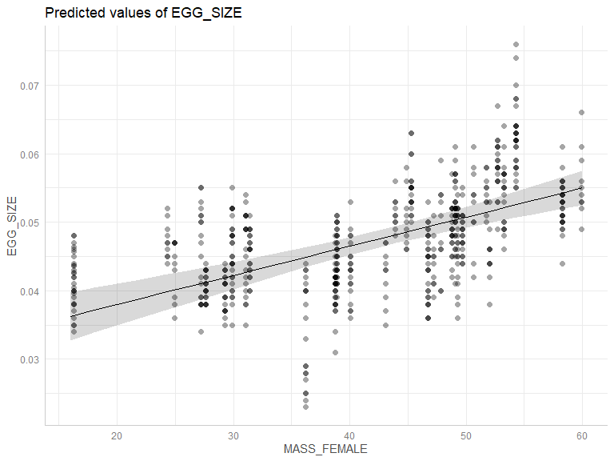

---
title: "02A. Maternal Effects and Reproduction: Egg size"
author: "Elliott Schmidt"
date: "2026-04-11"
output: 
  html_document: 
    keep_md: yes
    toc: true  
    toc_depth: 2
    toc_float: true
    code_folding: show
    collapse: no
    df_print: paged
    fig_caption: yes
    fig_height: 4
    fig_width: 6
    highlight: monochrome
    theme: cerulean
    latex_engine: xelatex
  pdf_document:
    df_print: default
    fig_caption: yes
    fig_height: 4
    fig_width: 4
    highlight: tango
    latex_engine: xelatex
    number_sections: yes
    toc_depth: 2
documentclass: article
--- 


```{=html}
<script>
  addClassKlippyTo("pre.r, pre.markdown");
  addKlippy('left', 'top', 'auto', '1', 'Copy code', 'Copied!');
</script>
```

# Location 


# Glossary 

--------------------- ------------------------------------------------------------------
**EGG_SIZE**          Area of egg
**MASS_FEMALE**       Mass of maternal fish 
**EGG_COUNT**         Number of eggs laid within a clutch 
**FEMALE**            Unique maternal identification code 
**DAYS_IN_TREATMENT** Number of days breeding pair were at experimental temperatures 
**CLUTCH_ORDER**      Clutch laid within a breeding season (1st, 2nd, 3rd etc)
**POPULATION**        Reef breeding pair were collected from
--------------------- -----------------------------------------------------------------
# Load libraries


``` r
library(tidyverse) # data manipulation
library(ggpubr) # producing data exploratory plots
library(modelsummary) # descriptive data 
library(glmmTMB) # running generalised mixed models 
library(DHARMa) # model diagnostics 
library(performance) # model diagnostics  
library(ggeffects) # partial effect plots 
library(car) # running Anova on model 
library(emmeans) # post-hoc analysis  
library(MuMIn) # model comparisons
library(lme4)  #blups
library(patchwork) #aligning plots
```

# Import data


``` r
setwd("C:/Users/elliott/OneDrive/jc527762/PhD dissertation/Data/Chapter3_Heritability_ARCHIVED")
egg <- read_csv("import_data/egg_size_data_2022_2023.csv") |> 
  mutate(across(1:14,factor))  |> 
  select(!c(NOTES,...18, IMAGE))   

reprod.data <- read_csv("import_data/clutch_data_2022_2023.csv") |> 
  mutate(across(c(1:7,16,23), factor))  |> 
  mutate(PROJECT_CODE =factor(PROJECT_CODE))
  

m2.5 <- read_csv("import_data/2-5_month_size_data_2022_2023.csv") |> 
  mutate(across(1:15,factor)) |> 
  mutate(STANDARD_LENGTH =LENGTH, 
         .keep = "unused") |> 
  select(!(NOTES)) |> 
  select(1:15,"STANDARD_LENGTH","MASS")|> 
  group_by(CLUTCH_NUMBER) |> 
  mutate(DENSITY = n()) |> 
  ungroup()

adult <- read_csv("import_data/adult_size_2022_2023.csv") |> 
  mutate(across(1:3,factor), 
         MALE = FISH_ID, 
         FEMALE = FISH_ID, 
         POPULATION = str_sub(FISH_ID, 2,4), 
         POPULATION = case_when(POPULATION == "ARL" ~ "Arlington Reef", 
                                POPULATION == "SUD" ~ "Sudbury Reef",
                                POPULATION == "VLA" ~ "Vlassof cay",
                                POPULATION == "PRE" ~ "Pretty patches", 
                                TRUE ~ POPULATION)) |> 
  left_join(select(m2.5, c("MALE","TEMPERATURE")), 
             by="MALE") |> 
  left_join(select(m2.5, c("FEMALE","TEMPERATURE")), 
             by="FEMALE") |>
  distinct() |> 
  mutate(TEMPERATURE = coalesce(TEMPERATURE.x, TEMPERATURE.y)) |> 
  drop_na(TEMPERATURE) |> 
  select(-c("TEMPERATURE.x","TEMPERATURE.y")) 
```

# Data manipulation


``` r
m2.5_df_all <- m2.5 |> 
  left_join(select(adult, c("MALE", "SL", "MASS")), 
            by ="MALE") |> 
  mutate(SL_MALE =SL, 
         MASS_MALE =MASS.y, 
         .keep = "unused") |>
  left_join(select(adult, c("FEMALE", "SL", "MASS")), 
            by ="FEMALE") |> 
  mutate(SL_FEMALE =SL, 
         MASS_FEMALE =MASS, 
         .keep ="unused") |> 
  mutate(SL_MIDPOINT = (SL_MALE+SL_FEMALE)/2, 
         MASS_MIDPOINT = (MASS_MALE+MASS_FEMALE)/2) 

m2.5_df <- m2.5_df_all |> drop_na(STANDARD_LENGTH) |>
  group_by(CLUTCH_NUMBER) |> 
  mutate(MEDIAN_STANDARD_LENGTH = median(STANDARD_LENGTH)) |>
  drop_na(MEDIAN_STANDARD_LENGTH) |>
  ungroup() |> 
  select(-c("STANDARD_LENGTH","MASS.x")) |> 
  distinct() |> 
  mutate(MASS_MIDPOINT =coalesce(MASS_MIDPOINT, MASS_MALE), 
         SL_MIDPOINT =coalesce(SL_MIDPOINT, SL_MALE)) 

clutches <- reprod.data |> filter(PROJECT_CODE %in% c("1","3","5","7")) |>
  select(CLUTCH_NUMBER)

egg_df_all <- egg |> 
  left_join(select(adult, c("MALE", "SL", "MASS")), 
            by ="MALE")  |> 
  mutate(SL_MALE =SL, 
         MASS_MALE =MASS, 
         .keep = "unused") |>
  left_join(select(adult, c("FEMALE", "SL", "MASS")), 
            by ="FEMALE") |> 
  mutate(SL_FEMALE =SL, 
         MASS_FEMALE =MASS, 
         .keep ="unused") |> 
  mutate(SL_MIDPOINT = (SL_MALE+SL_FEMALE)/2, 
         MASS_MIDPOINT = (MASS_MALE+MASS_FEMALE)/2) |> 
  left_join(select(reprod.data, c("CLUTCH_NUMBER","EGG_COUNT","HATCHING_SUCCESS")), by="CLUTCH_NUMBER") 


egg_df <- egg_df_all |>
  group_by(CLUTCH_NUMBER) |> 
  mutate(MEDIAN_EGG_SIZE = median(EGG_SIZE)) |> 
  drop_na(MEDIAN_EGG_SIZE) |>
  ungroup()  |> 
  select(-c("EGG_SIZE","SAMPLE")) |> 
  distinct() |> 
  mutate(MASS_MIDPOINT =coalesce(MASS_MIDPOINT, MASS_MALE), 
         SL_MIDPOINT =coalesce(SL_MIDPOINT, SL_MALE), 
         SL_FEMALE =coalesce(SL_FEMALE, SL_MALE))  # done for two individuals
  
egg_df <- clutches |> 
  inner_join(egg_df, by="CLUTCH_NUMBER")  

egg_df_all <- clutches |> 
  inner_join(egg_df_all, by="CLUTCH_NUMBER") 
```

# Exploratory data analysis 


``` r
plot1 <- ggplot(egg_df, aes(x=MASS_FEMALE, y=MEDIAN_EGG_SIZE, color=TEMPERATURE)) +
  geom_point(alpha=0.05) + 
  stat_smooth(method = "lm", se=FALSE) +
  scale_color_manual(values = c("#69d7d8","#ff9c56", "#903146")) + 
  ggtitle("EGG SIZE") +
  theme_classic()

plot2 <- ggplot(egg_df, aes(x=MASS_FEMALE, y=EGG_COUNT, color=TEMPERATURE)) +
  geom_point(alpha=0.05) + 
  stat_smooth(method = "lm", se=FALSE) +
  scale_color_manual(values = c("#69d7d8","#ff9c56", "#903146")) + 
  ggtitle("EGG COUNT") +
  theme_classic() 

plot3 <- ggplot(egg_df, aes(x=as.numeric(DAYS_IN_TREATMENT), y=EGG_COUNT, color=TEMPERATURE)) +
  geom_point(alpha=0.05) + 
  stat_smooth(method = "lm", se=FALSE) +
  scale_color_manual(values = c("#69d7d8","#ff9c56", "#903146")) + 
  ggtitle("EGG COUNT") +
  theme_classic()

ggarrange(plot1, plot2, 
          nrow=1, 
          ncol=2, 
          common.legend = TRUE)
```

<!-- -->

# Descriptive statistics 


``` r
table1 <- datasummary(Factor(POPULATION) + 1 ~ Factor(TEMPERATURE), 
            data=droplevels(egg_df),
            fmt = "%.0f") 
table1
```

```{=html}
<!-- preamble start -->

    <script src="https://cdn.jsdelivr.net/gh/vincentarelbundock/tinytable@main/inst/tinytable.js"></script>

    <script>
      // Create table-specific functions using external factory
      const tableFns_shhixp8d9rbqj78wllmk = TinyTable.createTableFunctions("tinytable_shhixp8d9rbqj78wllmk");
      // tinytable span after
      window.addEventListener('load', function () {
          var cellsToStyle = [
            // tinytable style arrays after
          { positions: [ { i: '5', j: 2 }, { i: '5', j: 3 }, { i: '5', j: 4 } ], css_id: 'tinytable_css_brb1fddyepn7pedsovqm',}, 
          { positions: [ { i: '1', j: 2 }, { i: '2', j: 2 }, { i: '3', j: 2 }, { i: '4', j: 2 }, { i: '1', j: 3 }, { i: '2', j: 3 }, { i: '3', j: 3 }, { i: '4', j: 3 }, { i: '1', j: 4 }, { i: '2', j: 4 }, { i: '3', j: 4 }, { i: '4', j: 4 } ], css_id: 'tinytable_css_6j335db5360d7lhvlvy6',}, 
          { positions: [ { i: '0', j: 2 }, { i: '0', j: 3 }, { i: '0', j: 4 } ], css_id: 'tinytable_css_2t4jwroncet7lxrm4t5t',}, 
          { positions: [ { i: '5', j: 1 } ], css_id: 'tinytable_css_jifkog9wba0uu5y9ig3j',}, 
          { positions: [ { i: '1', j: 1 }, { i: '2', j: 1 }, { i: '3', j: 1 }, { i: '4', j: 1 } ], css_id: 'tinytable_css_jq2zdr8gwheifg9y9j4m',}, 
          { positions: [ { i: '0', j: 1 } ], css_id: 'tinytable_css_5gxfkphwsiipqucqfhgp',}, 
          ];

          // Loop over the arrays to style the cells
          cellsToStyle.forEach(function (group) {
              group.positions.forEach(function (cell) {
                  tableFns_shhixp8d9rbqj78wllmk.styleCell(cell.i, cell.j, group.css_id);
              });
          });
      });
    </script>

    <link rel="stylesheet" href="https://cdn.jsdelivr.net/gh/vincentarelbundock/tinytable@main/inst/tinytable.css">
    <style>
    /* tinytable css entries after */
    #tinytable_shhixp8d9rbqj78wllmk td.tinytable_css_brb1fddyepn7pedsovqm, #tinytable_shhixp8d9rbqj78wllmk th.tinytable_css_brb1fddyepn7pedsovqm {  position: relative; --border-bottom: 1; --border-left: 0; --border-right: 0; --border-top: 0; --line-color-bottom: var(--tt-line-color); --line-color-left: var(--tt-line-color); --line-color-right: var(--tt-line-color); --line-color-top: var(--tt-line-color); --line-width-bottom: 0.08em; --line-width-left: 0.1em; --line-width-right: 0.1em; --line-width-top: 0.1em; --trim-bottom-left: 0%; --trim-bottom-right: 0%; --trim-left-bottom: 0%; --trim-left-top: 0%; --trim-right-bottom: 0%; --trim-right-top: 0%; --trim-top-left: 0%; --trim-top-right: 0%; ; text-align: right }
    #tinytable_shhixp8d9rbqj78wllmk td.tinytable_css_6j335db5360d7lhvlvy6, #tinytable_shhixp8d9rbqj78wllmk th.tinytable_css_6j335db5360d7lhvlvy6 { text-align: right }
    #tinytable_shhixp8d9rbqj78wllmk td.tinytable_css_2t4jwroncet7lxrm4t5t, #tinytable_shhixp8d9rbqj78wllmk th.tinytable_css_2t4jwroncet7lxrm4t5t {  position: relative; --border-bottom: 1; --border-left: 0; --border-right: 0; --border-top: 1; --line-color-bottom: var(--tt-line-color); --line-color-left: var(--tt-line-color); --line-color-right: var(--tt-line-color); --line-color-top: var(--tt-line-color); --line-width-bottom: 0.05em; --line-width-left: 0.1em; --line-width-right: 0.1em; --line-width-top: 0.08em; --trim-bottom-left: 0%; --trim-bottom-right: 0%; --trim-left-bottom: 0%; --trim-left-top: 0%; --trim-right-bottom: 0%; --trim-right-top: 0%; --trim-top-left: 0%; --trim-top-right: 0%; ; text-align: right }
    #tinytable_shhixp8d9rbqj78wllmk td.tinytable_css_jifkog9wba0uu5y9ig3j, #tinytable_shhixp8d9rbqj78wllmk th.tinytable_css_jifkog9wba0uu5y9ig3j {  position: relative; --border-bottom: 1; --border-left: 0; --border-right: 0; --border-top: 0; --line-color-bottom: var(--tt-line-color); --line-color-left: var(--tt-line-color); --line-color-right: var(--tt-line-color); --line-color-top: var(--tt-line-color); --line-width-bottom: 0.08em; --line-width-left: 0.1em; --line-width-right: 0.1em; --line-width-top: 0.1em; --trim-bottom-left: 0%; --trim-bottom-right: 0%; --trim-left-bottom: 0%; --trim-left-top: 0%; --trim-right-bottom: 0%; --trim-right-top: 0%; --trim-top-left: 0%; --trim-top-right: 0%; ; text-align: left }
    #tinytable_shhixp8d9rbqj78wllmk td.tinytable_css_jq2zdr8gwheifg9y9j4m, #tinytable_shhixp8d9rbqj78wllmk th.tinytable_css_jq2zdr8gwheifg9y9j4m { text-align: left }
    #tinytable_shhixp8d9rbqj78wllmk td.tinytable_css_5gxfkphwsiipqucqfhgp, #tinytable_shhixp8d9rbqj78wllmk th.tinytable_css_5gxfkphwsiipqucqfhgp {  position: relative; --border-bottom: 1; --border-left: 0; --border-right: 0; --border-top: 1; --line-color-bottom: var(--tt-line-color); --line-color-left: var(--tt-line-color); --line-color-right: var(--tt-line-color); --line-color-top: var(--tt-line-color); --line-width-bottom: 0.05em; --line-width-left: 0.1em; --line-width-right: 0.1em; --line-width-top: 0.08em; --trim-bottom-left: 0%; --trim-bottom-right: 0%; --trim-left-bottom: 0%; --trim-left-top: 0%; --trim-right-bottom: 0%; --trim-right-top: 0%; --trim-top-left: 0%; --trim-top-right: 0%; ; text-align: left }
    </style>
    <div class="container">
      <table class="tinytable" id="tinytable_shhixp8d9rbqj78wllmk" style="width: auto; margin-left: auto; margin-right: auto;" data-quarto-disable-processing='true'>
        
        <thead>
              <tr>
                <th scope="col" data-row="0" data-col="1">POPULATION</th>
                <th scope="col" data-row="0" data-col="2">27</th>
                <th scope="col" data-row="0" data-col="3">28.5</th>
                <th scope="col" data-row="0" data-col="4">30</th>
              </tr>
        </thead>
        
        <tbody>
                <tr>
                  <td data-row="1" data-col="1">Arlington Reef</td>
                  <td data-row="1" data-col="2">9</td>
                  <td data-row="1" data-col="3">6</td>
                  <td data-row="1" data-col="4">8</td>
                </tr>
                <tr>
                  <td data-row="2" data-col="1">Pretty Patches</td>
                  <td data-row="2" data-col="2">4</td>
                  <td data-row="2" data-col="3">3</td>
                  <td data-row="2" data-col="4">6</td>
                </tr>
                <tr>
                  <td data-row="3" data-col="1">Sudbury Reef</td>
                  <td data-row="3" data-col="2">4</td>
                  <td data-row="3" data-col="3">2</td>
                  <td data-row="3" data-col="4">3</td>
                </tr>
                <tr>
                  <td data-row="4" data-col="1">Vlassof Cay</td>
                  <td data-row="4" data-col="2">4</td>
                  <td data-row="4" data-col="3">2</td>
                  <td data-row="4" data-col="4">3</td>
                </tr>
                <tr>
                  <td data-row="5" data-col="1">All</td>
                  <td data-row="5" data-col="2">21</td>
                  <td data-row="5" data-col="3">13</td>
                  <td data-row="5" data-col="4">20</td>
                </tr>
        </tbody>
      </table>
    </div>
<!-- hack to avoid NA insertion in last line -->
```


``` r
table2 <- datasummary(Factor(TEMPERATURE) ~ EGG_SIZE * (NUnique + mean + median + min + max + sd + Histogram), 
            data = drop_na(egg_df_all),  
            fmt = "%.2f") 
table2
```

```{=html}
<!-- preamble start -->

    <script src="https://cdn.jsdelivr.net/gh/vincentarelbundock/tinytable@main/inst/tinytable.js"></script>

    <script>
      // Create table-specific functions using external factory
      const tableFns_ar7hyhp1bhn0j0um3hmt = TinyTable.createTableFunctions("tinytable_ar7hyhp1bhn0j0um3hmt");
      // tinytable span after
      window.addEventListener('load', function () {
          var cellsToStyle = [
            // tinytable style arrays after
          { positions: [ { i: '3', j: 2 }, { i: '3', j: 3 }, { i: '3', j: 4 }, { i: '3', j: 5 }, { i: '3', j: 6 }, { i: '3', j: 7 }, { i: '3', j: 8 } ], css_id: 'tinytable_css_rg5jiae6jkpg6pqb8k30',}, 
          { positions: [ { i: '1', j: 2 }, { i: '2', j: 2 }, { i: '1', j: 3 }, { i: '2', j: 3 }, { i: '1', j: 4 }, { i: '2', j: 4 }, { i: '1', j: 5 }, { i: '2', j: 5 }, { i: '1', j: 6 }, { i: '2', j: 6 }, { i: '1', j: 7 }, { i: '2', j: 7 }, { i: '1', j: 8 }, { i: '2', j: 8 } ], css_id: 'tinytable_css_l8zu23a186hezfcih63w',}, 
          { positions: [ { i: '0', j: 2 }, { i: '0', j: 3 }, { i: '0', j: 4 }, { i: '0', j: 5 }, { i: '0', j: 6 }, { i: '0', j: 7 }, { i: '0', j: 8 } ], css_id: 'tinytable_css_0ulf85vpiwj9wg7s7ewt',}, 
          { positions: [ { i: '3', j: 1 } ], css_id: 'tinytable_css_dymt1cjhyrwnz0xddm8y',}, 
          { positions: [ { i: '1', j: 1 }, { i: '2', j: 1 } ], css_id: 'tinytable_css_vcbxgaeqdkln86lxt4u6',}, 
          { positions: [ { i: '0', j: 1 } ], css_id: 'tinytable_css_1bdvjc1t0tsex37ok09b',}, 
          ];

          // Loop over the arrays to style the cells
          cellsToStyle.forEach(function (group) {
              group.positions.forEach(function (cell) {
                  tableFns_ar7hyhp1bhn0j0um3hmt.styleCell(cell.i, cell.j, group.css_id);
              });
          });
      });
    </script>

    <link rel="stylesheet" href="https://cdn.jsdelivr.net/gh/vincentarelbundock/tinytable@main/inst/tinytable.css">
    <style>
    /* tinytable css entries after */
    #tinytable_ar7hyhp1bhn0j0um3hmt td.tinytable_css_rg5jiae6jkpg6pqb8k30, #tinytable_ar7hyhp1bhn0j0um3hmt th.tinytable_css_rg5jiae6jkpg6pqb8k30 {  position: relative; --border-bottom: 1; --border-left: 0; --border-right: 0; --border-top: 0; --line-color-bottom: var(--tt-line-color); --line-color-left: var(--tt-line-color); --line-color-right: var(--tt-line-color); --line-color-top: var(--tt-line-color); --line-width-bottom: 0.08em; --line-width-left: 0.1em; --line-width-right: 0.1em; --line-width-top: 0.1em; --trim-bottom-left: 0%; --trim-bottom-right: 0%; --trim-left-bottom: 0%; --trim-left-top: 0%; --trim-right-bottom: 0%; --trim-right-top: 0%; --trim-top-left: 0%; --trim-top-right: 0%; ; text-align: right }
    #tinytable_ar7hyhp1bhn0j0um3hmt td.tinytable_css_l8zu23a186hezfcih63w, #tinytable_ar7hyhp1bhn0j0um3hmt th.tinytable_css_l8zu23a186hezfcih63w { text-align: right }
    #tinytable_ar7hyhp1bhn0j0um3hmt td.tinytable_css_0ulf85vpiwj9wg7s7ewt, #tinytable_ar7hyhp1bhn0j0um3hmt th.tinytable_css_0ulf85vpiwj9wg7s7ewt {  position: relative; --border-bottom: 1; --border-left: 0; --border-right: 0; --border-top: 1; --line-color-bottom: var(--tt-line-color); --line-color-left: var(--tt-line-color); --line-color-right: var(--tt-line-color); --line-color-top: var(--tt-line-color); --line-width-bottom: 0.05em; --line-width-left: 0.1em; --line-width-right: 0.1em; --line-width-top: 0.08em; --trim-bottom-left: 0%; --trim-bottom-right: 0%; --trim-left-bottom: 0%; --trim-left-top: 0%; --trim-right-bottom: 0%; --trim-right-top: 0%; --trim-top-left: 0%; --trim-top-right: 0%; ; text-align: right }
    #tinytable_ar7hyhp1bhn0j0um3hmt td.tinytable_css_dymt1cjhyrwnz0xddm8y, #tinytable_ar7hyhp1bhn0j0um3hmt th.tinytable_css_dymt1cjhyrwnz0xddm8y {  position: relative; --border-bottom: 1; --border-left: 0; --border-right: 0; --border-top: 0; --line-color-bottom: var(--tt-line-color); --line-color-left: var(--tt-line-color); --line-color-right: var(--tt-line-color); --line-color-top: var(--tt-line-color); --line-width-bottom: 0.08em; --line-width-left: 0.1em; --line-width-right: 0.1em; --line-width-top: 0.1em; --trim-bottom-left: 0%; --trim-bottom-right: 0%; --trim-left-bottom: 0%; --trim-left-top: 0%; --trim-right-bottom: 0%; --trim-right-top: 0%; --trim-top-left: 0%; --trim-top-right: 0%; ; text-align: left }
    #tinytable_ar7hyhp1bhn0j0um3hmt td.tinytable_css_vcbxgaeqdkln86lxt4u6, #tinytable_ar7hyhp1bhn0j0um3hmt th.tinytable_css_vcbxgaeqdkln86lxt4u6 { text-align: left }
    #tinytable_ar7hyhp1bhn0j0um3hmt td.tinytable_css_1bdvjc1t0tsex37ok09b, #tinytable_ar7hyhp1bhn0j0um3hmt th.tinytable_css_1bdvjc1t0tsex37ok09b {  position: relative; --border-bottom: 1; --border-left: 0; --border-right: 0; --border-top: 1; --line-color-bottom: var(--tt-line-color); --line-color-left: var(--tt-line-color); --line-color-right: var(--tt-line-color); --line-color-top: var(--tt-line-color); --line-width-bottom: 0.05em; --line-width-left: 0.1em; --line-width-right: 0.1em; --line-width-top: 0.08em; --trim-bottom-left: 0%; --trim-bottom-right: 0%; --trim-left-bottom: 0%; --trim-left-top: 0%; --trim-right-bottom: 0%; --trim-right-top: 0%; --trim-top-left: 0%; --trim-top-right: 0%; ; text-align: left }
    </style>
    <div class="container">
      <table class="tinytable" id="tinytable_ar7hyhp1bhn0j0um3hmt" style="width: auto; margin-left: auto; margin-right: auto;" data-quarto-disable-processing='true'>
        
        <thead>
              <tr>
                <th scope="col" data-row="0" data-col="1">TEMPERATURE</th>
                <th scope="col" data-row="0" data-col="2">NUnique</th>
                <th scope="col" data-row="0" data-col="3">mean</th>
                <th scope="col" data-row="0" data-col="4">median</th>
                <th scope="col" data-row="0" data-col="5">min</th>
                <th scope="col" data-row="0" data-col="6">max</th>
                <th scope="col" data-row="0" data-col="7">sd</th>
                <th scope="col" data-row="0" data-col="8">Histogram</th>
              </tr>
        </thead>
        
        <tbody>
                <tr>
                  <td data-row="1" data-col="1">27</td>
                  <td data-row="1" data-col="2">33</td>
                  <td data-row="1" data-col="3">0.05</td>
                  <td data-row="1" data-col="4">0.05</td>
                  <td data-row="1" data-col="5">0.04</td>
                  <td data-row="1" data-col="6">0.08</td>
                  <td data-row="1" data-col="7">0.01</td>
                  <td data-row="1" data-col="8">▁▂▄▇▅▃▂▁</td>
                </tr>
                <tr>
                  <td data-row="2" data-col="1">28.5</td>
                  <td data-row="2" data-col="2">29</td>
                  <td data-row="2" data-col="3">0.05</td>
                  <td data-row="2" data-col="4">0.05</td>
                  <td data-row="2" data-col="5">0.03</td>
                  <td data-row="2" data-col="6">0.06</td>
                  <td data-row="2" data-col="7">0.01</td>
                  <td data-row="2" data-col="8">▂▅▅▆▇▆▆▃▁▁</td>
                </tr>
                <tr>
                  <td data-row="3" data-col="1">30</td>
                  <td data-row="3" data-col="2">24</td>
                  <td data-row="3" data-col="3">0.04</td>
                  <td data-row="3" data-col="4">0.04</td>
                  <td data-row="3" data-col="5">0.04</td>
                  <td data-row="3" data-col="6">0.06</td>
                  <td data-row="3" data-col="7">0.01</td>
                  <td data-row="3" data-col="8">▂▃▄▇▃▃▃▂▁▁</td>
                </tr>
        </tbody>
      </table>
    </div>
<!-- hack to avoid NA insertion in last line -->
```


``` r
sample_size_egg_size <- egg_df_all |> drop_na(EGG_SIZE) |> 
  group_by(TEMPERATURE, MALE, FEMALE, POPULATION, CLUTCH_NUMBER) |> 
  summarise(n =n(), .groups = "drop"); sample_size_egg_size
```

<div data-pagedtable="false">
  <script data-pagedtable-source type="application/json">
{"columns":[{"label":["TEMPERATURE"],"name":[1],"type":["fct"],"align":["left"]},{"label":["MALE"],"name":[2],"type":["fct"],"align":["left"]},{"label":["FEMALE"],"name":[3],"type":["fct"],"align":["left"]},{"label":["POPULATION"],"name":[4],"type":["fct"],"align":["left"]},{"label":["CLUTCH_NUMBER"],"name":[5],"type":["fct"],"align":["left"]},{"label":["n"],"name":[6],"type":["int"],"align":["right"]}],"data":[{"1":"27","2":"CARL230","3":"CARL235","4":"Arlington Reef","5":"81","6":"10"},{"1":"27","2":"CARL230","3":"CARL235","4":"Arlington Reef","5":"122","6":"10"},{"1":"27","2":"CARL237","3":"CARL219","4":"Arlington Reef","5":"40","6":"10"},{"1":"27","2":"CARL237","3":"CARL219","4":"Arlington Reef","5":"80","6":"10"},{"1":"27","2":"CARL241","3":"CARL239","4":"Arlington Reef","5":"57","6":"10"},{"1":"27","2":"CARL241","3":"CARL239","4":"Arlington Reef","5":"91","6":"10"},{"1":"27","2":"CARL354","3":"CARL355","4":"Arlington Reef","5":"59","6":"10"},{"1":"27","2":"CARL354","3":"CARL355","4":"Arlington Reef","5":"85","6":"10"},{"1":"27","2":"CARL354","3":"CARL355","4":"Arlington Reef","5":"112","6":"10"},{"1":"27","2":"CPRE372","3":"CPRE209","4":"Pretty Patches","5":"38","6":"10"},{"1":"27","2":"CPRE372","3":"CPRE209","4":"Pretty Patches","5":"76","6":"10"},{"1":"27","2":"CPRE375","3":"CPRE377","4":"Pretty Patches","5":"66","6":"10"},{"1":"27","2":"CPRE375","3":"CPRE377","4":"Pretty Patches","5":"105","6":"10"},{"1":"27","2":"CSUD009","3":"CSUD212","4":"Sudbury Reef","5":"63","6":"10"},{"1":"27","2":"CSUD009","3":"CSUD212","4":"Sudbury Reef","5":"93","6":"10"},{"1":"27","2":"CSUD013","3":"CSUD017","4":"Sudbury Reef","5":"48","6":"10"},{"1":"27","2":"CSUD013","3":"CSUD017","4":"Sudbury Reef","5":"67","6":"10"},{"1":"27","2":"CVLA102","3":"CVLA466","4":"Vlassof Cay","5":"116","6":"10"},{"1":"27","2":"CVLA468","3":"CVLA477","4":"Vlassof Cay","5":"111","6":"10"},{"1":"27","2":"CVLA468","3":"CVLA477","4":"Vlassof Cay","5":"132","6":"10"},{"1":"27","2":"CVLA486","3":"CVLA463","4":"Vlassof Cay","5":"129","6":"10"},{"1":"28.5","2":"CARL217","3":"CARL226","4":"Arlington Reef","5":"56","6":"10"},{"1":"28.5","2":"CARL335","3":"CARL359","4":"Arlington Reef","5":"99","6":"10"},{"1":"28.5","2":"CARL335","3":"CARL359","4":"Arlington Reef","5":"133","6":"10"},{"1":"28.5","2":"CARL338","3":"CARL345","4":"Arlington Reef","5":"96","6":"10"},{"1":"28.5","2":"CARL367","3":"CARL363","4":"Arlington Reef","5":"109","6":"10"},{"1":"28.5","2":"CARL369","3":"CARL349","4":"Arlington Reef","5":"108","6":"10"},{"1":"28.5","2":"CPRE453","3":"CPRE459","4":"Pretty Patches","5":"110","6":"10"},{"1":"28.5","2":"CPRE521","3":"CPRE524","4":"Pretty Patches","5":"107","6":"10"},{"1":"28.5","2":"CPRE550","3":"CPRE533","4":"Pretty Patches","5":"120","6":"10"},{"1":"28.5","2":"CSUD002","3":"CSUD213","4":"Sudbury Reef","5":"92","6":"10"},{"1":"28.5","2":"CSUD016","3":"CSUD078","4":"Sudbury Reef","5":"61","6":"10"},{"1":"28.5","2":"CVLA049","3":"CVLA098","4":"Vlassof Cay","5":"49","6":"10"},{"1":"28.5","2":"CVLA049","3":"CVLA098","4":"Vlassof Cay","5":"62","6":"10"},{"1":"30","2":"CARL218","3":"CARL222","4":"Arlington Reef","5":"51","6":"10"},{"1":"30","2":"CARL218","3":"CARL222","4":"Arlington Reef","5":"68","6":"10"},{"1":"30","2":"CARL233","3":"CARL215","4":"Arlington Reef","5":"84","6":"10"},{"1":"30","2":"CARL344","3":"CARL370","4":"Arlington Reef","5":"47","6":"10"},{"1":"30","2":"CARL344","3":"CARL370","4":"Arlington Reef","5":"79","6":"10"},{"1":"30","2":"CARL360","3":"CARL249","4":"Arlington Reef","5":"100","6":"10"},{"1":"30","2":"CARL360","3":"CARL249","4":"Arlington Reef","5":"126","6":"10"},{"1":"30","2":"CPRE189","3":"CPRE202","4":"Pretty Patches","5":"55","6":"10"},{"1":"30","2":"CPRE189","3":"CPRE202","4":"Pretty Patches","5":"78","6":"10"},{"1":"30","2":"CPRE391","3":"CPRE390","4":"Pretty Patches","5":"86","6":"10"},{"1":"30","2":"CPRE391","3":"CPRE390","4":"Pretty Patches","5":"115","6":"10"},{"1":"30","2":"CPRE447","3":"CPRE452","4":"Pretty Patches","5":"104","6":"10"},{"1":"30","2":"CPRE447","3":"CPRE452","4":"Pretty Patches","5":"131","6":"10"},{"1":"30","2":"CSUD310","3":"CSUD306","4":"Sudbury Reef","5":"114","6":"10"},{"1":"30","2":"CSUD312","3":"CSUD304","4":"Sudbury Reef","5":"88","6":"10"},{"1":"30","2":"CSUD312","3":"CSUD304","4":"Sudbury Reef","5":"124","6":"10"},{"1":"30","2":"CVLA089","3":"CVLA059","4":"Vlassof Cay","5":"58","6":"10"},{"1":"30","2":"CVLA106","3":"CVLA091","4":"Vlassof Cay","5":"54","6":"10"},{"1":"30","2":"CVLA498","3":"CVLA493","4":"Vlassof Cay","5":"117","6":"10"}],"options":{"columns":{"min":{},"max":[10]},"rows":{"min":[10],"max":[10]},"pages":{}}}
  </script>
</div>

``` r
write.csv(sample_size_egg_size, "../../sample_size_egg_size.csv")
```


# Fit models [random factors] 


``` r
modelNULL <- glmmTMB(EGG_SIZE ~ 1, 
                  family=gaussian(),
                  data =egg_df_all)

model1 <- glmmTMB(EGG_SIZE ~ (1|CLUTCH_ORDER), 
                  family=gaussian(),
                  data = egg_df_all)

model2 <- glmmTMB(EGG_SIZE ~ (1|POPULATION), 
                  family=gaussian(),
                  data = egg_df_all)  

model3 <- glmmTMB(EGG_SIZE ~ (1|FEMALE), 
                  family=gaussian(),
                  data = egg_df_all)

model4 <- glmmTMB(EGG_SIZE ~ (1|FEMALE) + (1|POPULATION), 
                  family=gaussian(),
                  data = egg_df_all)

print(AIC(modelNULL, model1, model2, model3, model4, k=3))
```

```
##           df       AIC
## modelNULL  2 -3676.462
## model1     3 -3673.462
## model2     3 -3722.229
## model3     3 -4186.643
## model4     4 -4184.430
```

``` r
print(BIC(modelNULL, model1, model2, model3, model4))
```

```
##           df       BIC
## modelNULL  2 -3669.916
## model1     3 -3663.643
## model2     3 -3712.411
## model3     3 -4176.825
## model4     4 -4171.338
```

# Fit fixed factors

## Main hypothesis


``` r
model1a <- glmmTMB(EGG_SIZE ~ scale(MASS_FEMALE, center=TRUE)*TEMPERATURE + scale(EGG_COUNT, center=TRUE) + (1|FEMALE), 
                    family=gaussian(), 
                    data=egg_df_all)
```

## Alternative hypothesis


``` r
model1b <- glmmTMB(EGG_SIZE ~ scale(MASS_FEMALE, center=TRUE)*TEMPERATURE + scale(as.numeric(DAYS_IN_TREATMENT), center=TRUE) + scale(EGG_COUNT, center=TRUE) +  (1|FEMALE), 
                    family=gaussian(), 
                    data=egg_df_all)
```

## Model selection


``` r
print(AICc(model1a, model1b, k=5))
```

```
##         df      AICc
## model1a  9 -3858.570
## model1b 10 -3863.606
```

# Model validation {.tabset}

## DHARMa


``` r
model1b |> 
  simulateResiduals(plot=TRUE)  
```

<!-- -->

```
## Object of Class DHARMa with simulated residuals based on 250 simulations with refit = FALSE . See ?DHARMa::simulateResiduals for help. 
##  
## Scaled residual values: 0.376 0.032 0.32 0.04 0.116 0.188 0.044 0.088 0.132 0.012 0.7 0.708 0.56 0.516 0.656 0.772 0.78 0.58 0.956 0.528 ...
```

``` r
model1b |> testResiduals(plot=T) 
```

<!-- -->

```
## $uniformity
## 
## 	Asymptotic one-sample Kolmogorov-Smirnov test
## 
## data:  simulationOutput$scaledResiduals
## D = 0.020898, p-value = 0.983
## alternative hypothesis: two-sided
## 
## 
## $dispersion
## 
## 	DHARMa nonparametric dispersion test via sd of residuals fitted vs.
## 	simulated
## 
## data:  simulationOutput
## dispersion = 1.0385, p-value = 0.752
## alternative hypothesis: two.sided
## 
## 
## $outliers
## 
## 	DHARMa outlier test based on exact binomial test with approximate
## 	expectations
## 
## data:  simulationOutput
## outliers at both margin(s) = 3, observations = 490, p-value = 1
## alternative hypothesis: true probability of success is not equal to 0.007968127
## 95 percent confidence interval:
##  0.00126438 0.01778737
## sample estimates:
## frequency of outliers (expected: 0.00796812749003984 ) 
##                                            0.006122449
```

## performance 

<!-- -->

## {-} 

# Partial effect plots


``` r
model1b |> ggemmeans(~MASS_FEMALE) |> 
  plot() 
```

```
## NOTE: Results may be misleading due to involvement in interactions
```

<!-- -->

``` r
model1b |> ggemmeans(~TEMPERATURE) |> 
  plot()
```

```
## NOTE: Results may be misleading due to involvement in interactions
```

<!-- -->

``` r
model1b |> ggemmeans(~DAYS_IN_TREATMENT) |> 
  plot() 
```

<!-- -->

``` r
model1b |> ggemmeans(~EGG_COUNT) |> 
  plot() 
```

<!-- -->

``` r
model1b |> ggemmeans(~MASS_FEMALE|TEMPERATURE) |> 
  plot()
```

<!-- -->

# Model investigation {.tabset} 

## Summary


``` r
model1b |> summary()
```

```
##  Family: gaussian  ( identity )
## Formula:          EGG_SIZE ~ scale(MASS_FEMALE, center = TRUE) * TEMPERATURE +  
##     scale(as.numeric(DAYS_IN_TREATMENT), center = TRUE) + scale(EGG_COUNT,  
##     center = TRUE) + (1 | FEMALE)
## Data: egg_df_all
## 
##       AIC       BIC    logLik -2*log(L)  df.resid 
##   -3894.8   -3852.8    1957.4   -3914.8       480 
## 
## Random effects:
## 
## Conditional model:
##  Groups   Name        Variance  Std.Dev.
##  FEMALE   (Intercept) 1.235e-05 0.003514
##  Residual             1.692e-05 0.004114
## Number of obs: 490, groups:  FEMALE, 32
## 
## Dispersion estimate for gaussian family (sigma^2): 1.69e-05 
## 
## Conditional model:
##                                                       Estimate Std. Error
## (Intercept)                                          0.0499685  0.0012611
## scale(MASS_FEMALE, center = TRUE)                    0.0052621  0.0011487
## TEMPERATURE28.5                                     -0.0006912  0.0017350
## TEMPERATURE30                                       -0.0063130  0.0016806
## scale(as.numeric(DAYS_IN_TREATMENT), center = TRUE) -0.0010762  0.0003330
## scale(EGG_COUNT, center = TRUE)                     -0.0014515  0.0004728
## scale(MASS_FEMALE, center = TRUE):TEMPERATURE28.5   -0.0016172  0.0015099
## scale(MASS_FEMALE, center = TRUE):TEMPERATURE30     -0.0005207  0.0018171
##                                                     z value Pr(>|z|)    
## (Intercept)                                           39.62  < 2e-16 ***
## scale(MASS_FEMALE, center = TRUE)                      4.58 4.63e-06 ***
## TEMPERATURE28.5                                       -0.40 0.690371    
## TEMPERATURE30                                         -3.76 0.000172 ***
## scale(as.numeric(DAYS_IN_TREATMENT), center = TRUE)   -3.23 0.001230 ** 
## scale(EGG_COUNT, center = TRUE)                       -3.07 0.002142 ** 
## scale(MASS_FEMALE, center = TRUE):TEMPERATURE28.5     -1.07 0.284143    
## scale(MASS_FEMALE, center = TRUE):TEMPERATURE30       -0.29 0.774433    
## ---
## Signif. codes:  0 '***' 0.001 '**' 0.01 '*' 0.05 '.' 0.1 ' ' 1
```

## Anova


``` r
model1b |> car::Anova() |> print()
```

```
## Analysis of Deviance Table (Type II Wald chisquare tests)
## 
## Response: EGG_SIZE
##                                                       Chisq Df Pr(>Chisq)    
## scale(MASS_FEMALE, center = TRUE)                   40.4232  1  2.045e-10 ***
## TEMPERATURE                                         21.1281  2  2.583e-05 ***
## scale(as.numeric(DAYS_IN_TREATMENT), center = TRUE) 10.4443  1   0.001230 ** 
## scale(EGG_COUNT, center = TRUE)                      9.4239  1   0.002142 ** 
## scale(MASS_FEMALE, center = TRUE):TEMPERATURE        1.1972  2   0.549593    
## ---
## Signif. codes:  0 '***' 0.001 '**' 0.01 '*' 0.05 '.' 0.1 ' ' 1
```

## Confint


``` r
model1b |> confint()
```

```
##                                                            2.5 %        97.5 %
## (Intercept)                                          0.047496867  0.0524401367
## scale(MASS_FEMALE, center = TRUE)                    0.003010598  0.0075135205
## TEMPERATURE28.5                                     -0.004091776  0.0027094619
## TEMPERATURE30                                       -0.009606908 -0.0030191497
## scale(as.numeric(DAYS_IN_TREATMENT), center = TRUE) -0.001728885 -0.0004235182
## scale(EGG_COUNT, center = TRUE)                     -0.002378248 -0.0005247847
## scale(MASS_FEMALE, center = TRUE):TEMPERATURE28.5   -0.004576629  0.0013421826
## scale(MASS_FEMALE, center = TRUE):TEMPERATURE30     -0.004082156  0.0030406734
## Std.Dev.(Intercept)|FEMALE                           0.002683439  0.0046013736
##                                                          Estimate
## (Intercept)                                          0.0499685017
## scale(MASS_FEMALE, center = TRUE)                    0.0052620594
## TEMPERATURE28.5                                     -0.0006911571
## TEMPERATURE30                                       -0.0063130290
## scale(as.numeric(DAYS_IN_TREATMENT), center = TRUE) -0.0010762018
## scale(EGG_COUNT, center = TRUE)                     -0.0014515163
## scale(MASS_FEMALE, center = TRUE):TEMPERATURE28.5   -0.0016172233
## scale(MASS_FEMALE, center = TRUE):TEMPERATURE30     -0.0005207412
## Std.Dev.(Intercept)|FEMALE                           0.0035139020
```

## r-squared


``` r
model1b |> r2_nakagawa()
```

```
## # R2 for Mixed Models
## 
##   Conditional R2: 0.718
##      Marginal R2: 0.512
```
# Post-hoc analysis 


``` r
model1b |> emmeans(~TEMPERATURE, type ="response")
```

```
## NOTE: Results may be misleading due to involvement in interactions
```

```
##  TEMPERATURE emmean      SE  df asymp.LCL asymp.UCL
##  27          0.0503 0.00128 Inf    0.0478    0.0528
##  28.5        0.0496 0.00120 Inf    0.0473    0.0520
##  30          0.0440 0.00112 Inf    0.0418    0.0462
## 
## Confidence level used: 0.95
```

``` r
model1b |> emmeans(~TEMPERATURE, type ="response") |> pairs() |> summary() |> print()
```

```
## NOTE: Results may be misleading due to involvement in interactions
```

```
##  contrast                        estimate      SE  df z.ratio p.value
##  TEMPERATURE27 - TEMPERATURE28.5 0.000657 0.00174 Inf   0.379  0.9241
##  TEMPERATURE27 - TEMPERATURE30   0.006302 0.00169 Inf   3.733  0.0006
##  TEMPERATURE28.5 - TEMPERATURE30 0.005645 0.00163 Inf   3.464  0.0015
## 
## P value adjustment: tukey method for comparing a family of 3 estimates
```

``` r
egg.emmeans.df <- model1b |> emmeans(~TEMPERATURE, type ="response") |> as.data.frame()
```

```
## NOTE: Results may be misleading due to involvement in interactions
```

``` r
save(egg.emmeans.df, file="../../Figure_files/egg.emmeans.RData")
```

## {-}

# Summary figure 


``` r
egg_df_all <- egg_df_all |> drop_na(EGG_SIZE, MASS_FEMALE, EGG_COUNT)
egg.emm <- emmeans(model1b, ~ MASS_FEMALE*TEMPERATURE, 
                 at =list(MASS_FEMALE=seq(from =min(egg_df_all$MASS_FEMALE), to =max(egg_df_all$MASS_FEMALE), by=.25)))

egg.df <- as.data.frame(egg.emm)

egg.obs <- egg_df_all |> 
  mutate(Pred =predict(model1b, re.form=NULL, type ='response'), 
         Resid =residuals(model1b, type ='response'), 
         Fit =Pred+Resid) 

egg.obs.summarize <-  egg.obs |> 
  group_by(FEMALE, TEMPERATURE) |> 
  summarise(mean.eggsize =mean(Fit, na.rm=TRUE), 
            mean.mass.female =mean(MASS_FEMALE, na.rm = TRUE), 
            sd.eggsize =sd(Fit, na.rm =TRUE), 
            n.eggsize = n()) |> 
  mutate(se.eggsize = sd.eggsize / sqrt(n.eggsize), 
         lower.ci.eggsize =mean.eggsize - qt(1-(0.05/2), n.eggsize -1) * se.eggsize, 
         upper.ci.eggsize =mean.eggsize + qt(1-(0.05/2), n.eggsize -1) * se.eggsize) |> 
  ungroup() 

egg.obs.summarize2 <- egg.obs.summarize |> 
  group_by(TEMPERATURE) |> 
  mutate(temp_mean =mean(mean.eggsize), 
         temp_sd =sd(mean.eggsize)) |> 
  distinct(temp_mean, .keep_all = TRUE) 

mod = lm(mean.eggsize ~ mean.mass.female*TEMPERATURE,  
         data =egg.obs.summarize)

mod.mass <- emmeans(mod, ~ mean.mass.female*TEMPERATURE, 
                 at =list(mean.mass.female=seq(from =min(egg.obs.summarize$mean.mass.female), to =max(egg.obs.summarize$mean.mass.female), by=.25))) |> as.data.frame()

egg.plot <- ggplot(data = egg.df, aes(x=MASS_FEMALE, y=response)) + 
  stat_smooth(data=egg.obs.summarize, aes(x =mean.mass.female, 
                                                  y =mean.eggsize, color=TEMPERATURE), 
              method = "lm", 
              se=FALSE) + 
  geom_ribbon(data=mod.mass, aes(x =mean.mass.female, 
                                                  y =emmean, 
                               ymin=lower.CL, ymax=upper.CL, fill=TEMPERATURE), alpha=0.5) +
  geom_pointrange(data = egg.obs.summarize, aes(x =mean.mass.female, 
                                                  y =mean.eggsize, 
                                                  ymin =mean.eggsize - sd.eggsize, 
                                                  ymax =mean.eggsize + sd.eggsize, 
                                                  color = TEMPERATURE))  +  
  scale_color_manual(values = c("#69d7d8","#ff9c56", "#903146")) + 
  scale_fill_manual(values =c("#69d7d8","#ff9c56", "#903146")) +
  scale_y_continuous(limits = c(0.02,.07), breaks=seq(0.02, .07, .01)) +
  facet_wrap(~TEMPERATURE)+
  xlab("MATERNAL MASS (g)") + 
  ylab("Egg size (mm^2)") + 
  ggtitle("Maternal-egg size relationship") +
  theme_classic() + 
  theme(legend.position = "none") 

egg.plot2 <- ggplot(egg.obs.summarize, aes(x=TEMPERATURE, y=mean.eggsize, color=TEMPERATURE)) + 
  geom_pointrange(data=egg.obs.summarize2, 
                  aes(x=TEMPERATURE, 
                      y=temp_mean, 
                      ymin=temp_mean - temp_sd, 
                      ymax=temp_mean + temp_sd), 
                  size = 1) + 
  geom_jitter(width=0.05, 
              alpha=0.3) +  
  scale_color_manual(values = c("#69d7d8","#ff9c56", "#903146")) + 
  scale_fill_manual(values =c("#69d7d8","#ff9c56", "#903146")) +
  scale_y_continuous(limits = c(0.02,.07), breaks=seq(0.02, .07, .01))+
  theme_classic() + 
  ylab(bquote(`Egg area (mm)`^2)) + 
  theme(legend.position = c(0.8,0.85), 
                                legend.box.background = element_rect(color = "black", size=2))

egg.plot.final <-egg.plot + egg.plot2 + 
  plot_layout(guides = "collect" & theme(legend.position = "bottom"), 
              widths = c(2,1)); egg.plot.final
```

<!-- -->

``` r
save(egg.obs.summarize, file="../../Figure_files/egg.obs.summarize-fixed.RData")
save(egg.obs.summarize2, file="../../Figure_files/egg.obs.summarize2-fixed.RData")
```


# slopes


``` r
add.df <- split(egg.obs.summarize, egg.obs.summarize$TEMPERATURE) |> 
  map(~lm(mean.eggsize ~ mean.mass.female, data=.)) |> 
  map(summary) |> 
  map_dbl("r.squared") |> 
  as.data.frame()

add.df <- add.df |>
  mutate(TEMPERATURE = row.names(add.df)) |>
  rename(r.sqaured =names(add.df)[1]) 

df.results.eggsize <- egg.obs.summarize |> 
  group_by(TEMPERATURE) |> 
  do({ 
    mod = lm(mean.eggsize ~ mean.mass.female, data = .) 
    data.frame(group = "egg_size", 
               Slope = coef(mod)[2], 
               Heritability = coef(mod)[2]*2)
    }) |> 
  as.data.frame() |> 
  mutate(Heritability = case_when(Heritability <=0 ~ 0, 
                                  TRUE ~ Heritability)) |> 
  inner_join(add.df, by="TEMPERATURE"); df.results.eggsize
```

<div data-pagedtable="false">
  <script data-pagedtable-source type="application/json">
{"columns":[{"label":["TEMPERATURE"],"name":[1],"type":["chr"],"align":["left"]},{"label":["group"],"name":[2],"type":["chr"],"align":["left"]},{"label":["Slope"],"name":[3],"type":["dbl"],"align":["right"]},{"label":["Heritability"],"name":[4],"type":["dbl"],"align":["right"]},{"label":["r.sqaured"],"name":[5],"type":["dbl"],"align":["right"]}],"data":[{"1":"27","2":"egg_size","3":"0.0004012830","4":"0.0008025660","5":"0.5608827"},{"1":"28.5","2":"egg_size","3":"0.0002761520","4":"0.0005523040","5":"0.3855880"},{"1":"30","2":"egg_size","3":"0.0004274167","4":"0.0008548335","5":"0.4775881"}],"options":{"columns":{"min":{},"max":[10]},"rows":{"min":[10],"max":[10]},"pages":{}}}
  </script>
</div>

# Within parental variation 


``` r
cv_within <- egg.obs |> 
  group_by(FEMALE) |> 
  mutate(mean_value =mean(Fit), 
         sd_value =sd(Fit), 
         CV =(sd_value/mean_value) * 100) |>
  ungroup() |> 
  select(-c("SAMPLE","Pred","Fit","Resid")) |> 
  distinct(FEMALE, .keep_all=TRUE) 

within_var <- aov(CV ~ TEMPERATURE, 
                  data=cv_within) 
summary(within_var) 
```

```
##             Df Sum Sq Mean Sq F value Pr(>F)
## TEMPERATURE  2   11.1   5.528   0.454  0.639
## Residuals   29  353.0  12.174
```

``` r
emmeans(within_var, ~TEMPERATURE)
```

```
##  TEMPERATURE emmean   SE df lower.CL upper.CL
##  27            8.40 1.10 29     6.14    10.65
##  28.5          7.79 1.05 29     5.63     9.94
##  30            9.20 1.05 29     7.05    11.35
## 
## Confidence level used: 0.95
```

``` r
cv_within_summ <- cv_within |> 
  group_by(TEMPERATURE) |> 
  mutate(mean_CV =mean(CV), 
         mean_mean =mean(mean_value), 
         mean_sd =mean(sd_value),
         nsample =n()) |>
  mutate(ser_value = sd_value/sqrt(nsample), 
         lower.ci =mean_CV - qt(1-(0.05/2), nsample -1) * ser_value, 
         upper.ci =mean_CV + qt(1-(0.05/2), nsample -1) * ser_value) |>
  ungroup() |> 
  distinct(TEMPERATURE, .keep_all=TRUE) |> 
  select(c("TEMPERATURE","mean_CV","mean_mean","mean_sd")) |> 
  arrange(TEMPERATURE); cv_within_summ
```

<div data-pagedtable="false">
  <script data-pagedtable-source type="application/json">
{"columns":[{"label":["TEMPERATURE"],"name":[1],"type":["fct"],"align":["left"]},{"label":["mean_CV"],"name":[2],"type":["dbl"],"align":["right"]},{"label":["mean_mean"],"name":[3],"type":["dbl"],"align":["right"]},{"label":["mean_sd"],"name":[4],"type":["dbl"],"align":["right"]}],"data":[{"1":"27","2":"8.395670","3":"0.05209333","4":"0.004330323"},{"1":"28.5","2":"7.785023","3":"0.04812727","4":"0.003707758"},{"1":"30","2":"9.198734","3":"0.04415909","4":"0.003917388"}],"options":{"columns":{"min":{},"max":[10]},"rows":{"min":[10],"max":[10]},"pages":{}}}
  </script>
</div>

# variation among clutches

``` r
cv_among <- cv_within |> 
  group_by(TEMPERATURE) |> 
  mutate(mean_among =mean(CV), 
         sd_among =sd(CV), 
         nsamples=n(),
         cv_among =(sd_among/mean_among)*100) |> 
  ungroup() |> 
  distinct(cv_among, .keep_all = T) |> 
  select(c("TEMPERATURE","cv_among","sd_among","mean_among","nsamples")) |> 
  arrange(TEMPERATURE)

##final cv values
cv_among2 <- data.frame(x=c("27v30","28v30","27v28"))
cv_among2$cv_among[1] =log(cv_among$cv_among[1]/cv_among$cv_among[3]) 
cv_among2$cv_among[2] =log(cv_among$cv_among[2]/cv_among$cv_among[3]) 
cv_among2$cv_among[3] =log(cv_among$cv_among[1]/cv_among$cv_among[2]) 

cv_among; cv_among2
```

<div data-pagedtable="false">
  <script data-pagedtable-source type="application/json">
{"columns":[{"label":["TEMPERATURE"],"name":[1],"type":["fct"],"align":["left"]},{"label":["cv_among"],"name":[2],"type":["dbl"],"align":["right"]},{"label":["sd_among"],"name":[3],"type":["dbl"],"align":["right"]},{"label":["mean_among"],"name":[4],"type":["dbl"],"align":["right"]},{"label":["nsamples"],"name":[5],"type":["int"],"align":["right"]}],"data":[{"1":"27","2":"29.09397","3":"2.442634","4":"8.395670","5":"10"},{"1":"28.5","2":"35.09604","3":"2.732235","4":"7.785023","5":"11"},{"1":"30","2":"51.52990","3":"4.740099","4":"9.198734","5":"11"}],"options":{"columns":{"min":{},"max":[10]},"rows":{"min":[10],"max":[10]},"pages":{}}}
  </script>
</div><div data-pagedtable="false">
  <script data-pagedtable-source type="application/json">
{"columns":[{"label":["x"],"name":[1],"type":["chr"],"align":["left"]},{"label":["cv_among"],"name":[2],"type":["dbl"],"align":["right"]}],"data":[{"1":"27v30","2":"-0.5716312"},{"1":"28v30","2":"-0.3840739"},{"1":"27v28","2":"-0.1875573"}],"options":{"columns":{"min":{},"max":[10]},"rows":{"min":[10],"max":[10]},"pages":{}}}
  </script>
</div>


