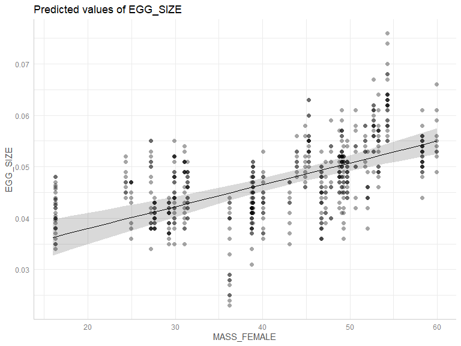

---
title: "02A. Maternal Effects and Reproduction: Egg size"
author: "Elliott Schmidt"
date: "2024-12-16"
output: 
  html_document: 
    keep_md: yes
    toc: true  
    toc_depth: 2
    toc_float: true
    code_folding: show
    collapse: no
    df_print: paged
    fig_caption: yes
    fig_height: 4
    fig_width: 6
    highlight: monochrome
    theme: cerulean
    latex_engine: xelatex
--- 


```{=html}
<script>
  addClassKlippyTo("pre.r, pre.markdown");
  addKlippy('left', 'top', 'auto', '1', 'Copy code', 'Copied!');
</script>
```

# Scenario 

Understanding species responses to climate change is inherently complex as organisms are constantly responding to changes in their environment via natural selection. However, for species to retain their capacity to respond to climate via natural selection, heritability of traits as well as phenotypic variation in fitness-related traits must be retained. By investigating shifts in heritability and phenotypic variation under elevated temperatures, an understanding of species ability to respond to climate change can be understood. Yet, for many species, shifts in adaptive potential and phenotypic variance are not incorporated into models that aim to predict species responses to climate change. Within this study a coral reef fish, _Acanthochromis polyacanthus_, was used to elucidate how heritability and phenotypic variation may influence species responses to warming. Adult breeding pairs and offspring were exposed to temperatures of **27 °C, 28.5 °C, and 30 °C**. Results below pertain to measured egg size from breeding pairs held at different experimental temperature treatments. 

# Location 


# Glossary 

--------------------- ------------------------------------------------------------------
**EGG_SIZE**          Area of egg
**MASS_FEMALE**       Mass of maternal fish 
**EGG_COUNT**         Number of eggs laid within a clutch 
**FEMALE**            Unique maternal identification code 
**DAYS_IN_TREATMENT** Number of days breeding pair were at experimental temperatures 
**CLUTCH_ORDER**      Clutch laid within a breeding season (1st, 2nd, 3rd etc)
**POPULATION**        Reef breeding pair were collected from
--------------------- -----------------------------------------------------------------
# Load libraries


``` r
library(tidyverse) # data manipulation
library(ggpubr) # producing data exploratory plots
library(modelsummary) # descriptive data 
library(glmmTMB) # running generalised mixed models 
library(DHARMa) # model diagnostics 
library(performance) # model diagnostics  
library(ggeffects) # partial effect plots 
library(car) # running Anova on model 
library(emmeans) # post-hoc analysis  
library(MuMIn) # model comparisons
library(lme4)  #blups
library(patchwork) #aligning plots
```

# Import data


``` r
egg <- read_csv("import_data/egg_size_data_2022_2023.csv") |> 
  mutate(across(1:14,factor))  |> 
  select(!c(NOTES,...18, IMAGE))   

reprod.data <- read_csv("import_data/clutch_data_2022_2023.csv") |> 
  mutate(across(c(1:7,16,23), factor))  
  

m2.5 <- read_csv("import_data/2-5_month_size_data_2022_2023.csv") |> 
  mutate(across(1:15,factor)) |> 
  mutate(STANDARD_LENGTH =LENGTH, 
         .keep = "unused") |> 
  select(!(NOTES)) |> 
  select(1:15,"STANDARD_LENGTH","MASS")|> 
  group_by(CLUTCH_NUMBER) |> 
  mutate(DENSITY = n()) |> 
  ungroup()

adult <- read_csv("import_data/adult_size_2022_2023.csv") |> 
  mutate(across(1:3,factor), 
         MALE = FISH_ID, 
         FEMALE = FISH_ID, 
         POPULATION = str_sub(FISH_ID, 2,4), 
         POPULATION = case_when(POPULATION == "ARL" ~ "Arlington Reef", 
                                POPULATION == "SUD" ~ "Sudbury Reef",
                                POPULATION == "VLA" ~ "Vlassof cay",
                                POPULATION == "PRE" ~ "Pretty patches", 
                                TRUE ~ POPULATION)) |> 
  left_join(select(m2.5, c("MALE","TEMPERATURE")), 
             by="MALE") |> 
  left_join(select(m2.5, c("FEMALE","TEMPERATURE")), 
             by="FEMALE") |>
  distinct() |> 
  mutate(TEMPERATURE = coalesce(TEMPERATURE.x, TEMPERATURE.y)) |> 
  drop_na(TEMPERATURE) |> 
  select(-c("TEMPERATURE.x","TEMPERATURE.y")) 
```

# Data manipulation


``` r
m2.5_df_all <- m2.5 |> 
  left_join(select(adult, c("MALE", "SL", "MASS")), 
            by ="MALE") |> 
  mutate(SL_MALE =SL, 
         MASS_MALE =MASS.y, 
         .keep = "unused") |>
  left_join(select(adult, c("FEMALE", "SL", "MASS")), 
            by ="FEMALE") |> 
  mutate(SL_FEMALE =SL, 
         MASS_FEMALE =MASS, 
         .keep ="unused") |> 
  mutate(SL_MIDPOINT = (SL_MALE+SL_FEMALE)/2, 
         MASS_MIDPOINT = (MASS_MALE+MASS_FEMALE)/2) 

m2.5_df <- m2.5_df_all |>
  group_by(CLUTCH_NUMBER) |> 
  mutate(MEDIAN_STANDARD_LENGTH = median(STANDARD_LENGTH)) |>
  drop_na(MEDIAN_STANDARD_LENGTH) |>
  ungroup() |> 
  select(-c("STANDARD_LENGTH","MASS.x")) |> 
  distinct() |> 
  mutate(MASS_MIDPOINT =coalesce(MASS_MIDPOINT, MASS_MALE), 
         SL_MIDPOINT =coalesce(SL_MIDPOINT, SL_MALE)) 

clutches <- m2.5_df |> 
  select(CLUTCH_NUMBER)
egg_df_all <- egg |> 
  left_join(select(adult, c("MALE", "SL", "MASS")), 
            by ="MALE")  |> 
  mutate(SL_MALE =SL, 
         MASS_MALE =MASS, 
         .keep = "unused") |>
  left_join(select(adult, c("FEMALE", "SL", "MASS")), 
            by ="FEMALE") |> 
  mutate(SL_FEMALE =SL, 
         MASS_FEMALE =MASS, 
         .keep ="unused") |> 
  mutate(SL_MIDPOINT = (SL_MALE+SL_FEMALE)/2, 
         MASS_MIDPOINT = (MASS_MALE+MASS_FEMALE)/2) |> 
  left_join(select(reprod.data, c("CLUTCH_NUMBER","EGG_COUNT","HATCHING_SUCCESS")), by="CLUTCH_NUMBER")

egg_df <- egg_df_all |>
  group_by(CLUTCH_NUMBER) |> 
  mutate(MEDIAN_EGG_SIZE = median(EGG_SIZE)) |> 
  drop_na(MEDIAN_EGG_SIZE) |>
  ungroup()  |> 
  select(-c("EGG_SIZE","SAMPLE")) |> 
  distinct() |> 
  mutate(MASS_MIDPOINT =coalesce(MASS_MIDPOINT, MASS_MALE), 
         SL_MIDPOINT =coalesce(SL_MIDPOINT, SL_MALE), 
         SL_FEMALE =coalesce(SL_FEMALE, SL_MALE))  # done for two individuals
  
egg_df <- clutches |> 
  inner_join(egg_df, by="CLUTCH_NUMBER") 
```

# Exploratory data analysis 


``` r
plot1 <- ggplot(egg_df, aes(x=MASS_FEMALE, y=MEDIAN_EGG_SIZE, color=TEMPERATURE)) +
  geom_point(alpha=0.05) + 
  stat_smooth(method = "lm", se=FALSE) +
  scale_color_manual(values = c("#69d7d8","#ff9c56", "#903146")) + 
  ggtitle("EGG SIZE") +
  theme_classic()

plot2 <- ggplot(egg_df, aes(x=MASS_FEMALE, y=EGG_COUNT, color=TEMPERATURE)) +
  geom_point(alpha=0.05) + 
  stat_smooth(method = "lm", se=FALSE) +
  scale_color_manual(values = c("#69d7d8","#ff9c56", "#903146")) + 
  ggtitle("EGG COUNT") +
  theme_classic() 

plot3 <- ggplot(egg_df, aes(x=as.numeric(DAYS_IN_TREATMENT), y=EGG_COUNT, color=TEMPERATURE)) +
  geom_point(alpha=0.05) + 
  stat_smooth(method = "lm", se=FALSE) +
  scale_color_manual(values = c("#69d7d8","#ff9c56", "#903146")) + 
  ggtitle("EGG COUNT") +
  theme_classic()

ggarrange(plot1, plot2, 
          nrow=1, 
          ncol=2, 
          common.legend = TRUE)
```

<!-- -->

# Descriptive statistics 


``` r
table1 <- datasummary(Factor(POPULATION) + 1 ~ Factor(TEMPERATURE), 
            data=droplevels(egg_df),
            fmt = "%.0f") 
print(table1@table_dataframe)
```

```
##       POPULATION 27 28.5 30
## 1 Arlington Reef 7    6  8 
## 2 Pretty Patches 4    4  3 
## 3 Sudbury Reef   3    2  2 
## 4 Vlassof Cay    3    2  3 
## 5 All            17   14 16
```


``` r
table2 <- datasummary(Factor(TEMPERATURE) ~ EGG_SIZE * (NUnique + mean + median + min + max + sd + Histogram), 
            data = drop_na(egg_df_all),  
            fmt = "%.2f") 
print(table2)
```

```
## 
## +-------------+---------+------+--------+------+------+------+------------+
## | TEMPERATURE | NUnique | mean | median | min  | max  | sd   | Histogram  |
## +=============+=========+======+========+======+======+======+============+
## | 27          | 33      | 0.05 | 0.05   | 0.04 | 0.08 | 0.01 | ▁▂▄▇▆▃▂▁   |
## +-------------+---------+------+--------+------+------+------+------------+
## | 28.5        | 41      | 0.05 | 0.05   | 0.03 | 0.06 | 0.01 | ▁▂▇▇▆▆▆▄▁▁ |
## +-------------+---------+------+--------+------+------+------+------------+
## | 30          | 24      | 0.04 | 0.04   | 0.04 | 0.06 | 0.01 | ▂▃▄▇▃▃▃▂▁▁ |
## +-------------+---------+------+--------+------+------+------+------------+
```

# Fit models [random factors] 


``` r
modelNULL <- glmmTMB(EGG_SIZE ~ 1, 
                  family=gaussian(),
                  data =egg_df_all)

model1 <- glmmTMB(EGG_SIZE ~ (1|CLUTCH_ORDER), 
                  family=gaussian(),
                  data = egg_df_all)

model2 <- glmmTMB(EGG_SIZE ~ (1|POPULATION), 
                  family=gaussian(),
                  data = egg_df_all)  

model3 <- glmmTMB(EGG_SIZE ~ (1|FEMALE), 
                  family=gaussian(),
                  data = egg_df_all)

model4 <- glmmTMB(EGG_SIZE ~ (1|FEMALE) + (1|POPULATION), 
                  family=gaussian(),
                  data = egg_df_all)

AIC(modelNULL, model1, model2, model3, model4, k=3) 
```

<div data-pagedtable="false">
  <script data-pagedtable-source type="application/json">
{"columns":[{"label":[""],"name":["_rn_"],"type":[""],"align":["left"]},{"label":["df"],"name":[1],"type":["dbl"],"align":["right"]},{"label":["AIC"],"name":[2],"type":["dbl"],"align":["right"]}],"data":[{"1":"2","2":"-6308.350","_rn_":"modelNULL"},{"1":"3","2":"-6305.916","_rn_":"model1"},{"1":"3","2":"-6488.199","_rn_":"model2"},{"1":"3","2":"-7075.279","_rn_":"model3"},{"1":"4","2":"-7075.215","_rn_":"model4"}],"options":{"columns":{"min":{},"max":[10]},"rows":{"min":[10],"max":[10]},"pages":{}}}
  </script>
</div>

``` r
BIC(modelNULL, model1, model2, model3, model4)
```

<div data-pagedtable="false">
  <script data-pagedtable-source type="application/json">
{"columns":[{"label":[""],"name":["_rn_"],"type":[""],"align":["left"]},{"label":["df"],"name":[1],"type":["dbl"],"align":["right"]},{"label":["BIC"],"name":[2],"type":["dbl"],"align":["right"]}],"data":[{"1":"2","2":"-6300.745","_rn_":"modelNULL"},{"1":"3","2":"-6294.509","_rn_":"model1"},{"1":"3","2":"-6476.792","_rn_":"model2"},{"1":"3","2":"-7063.871","_rn_":"model3"},{"1":"4","2":"-7060.006","_rn_":"model4"}],"options":{"columns":{"min":{},"max":[10]},"rows":{"min":[10],"max":[10]},"pages":{}}}
  </script>
</div>

# Fit fixed factors

## Main hypothesis


``` r
model1a <- glmmTMB(EGG_SIZE ~ scale(MASS_FEMALE, center=TRUE)*TEMPERATURE + scale(EGG_COUNT, center=TRUE) + (1|FEMALE), 
                    family=gaussian(), 
                    data=egg_df_all)
```

## Alternative hypothesis


``` r
model1b <- glmmTMB(EGG_SIZE ~ scale(MASS_FEMALE, center=TRUE)*TEMPERATURE + scale(as.numeric(DAYS_IN_TREATMENT), center=TRUE) + scale(EGG_COUNT, center=TRUE) +  (1|FEMALE), 
                    family=gaussian(), 
                    data=egg_df_all)
```

## Model selection


``` r
AICc(model1a, model1b, k=5) 
```

<div data-pagedtable="false">
  <script data-pagedtable-source type="application/json">
{"columns":[{"label":[""],"name":["_rn_"],"type":[""],"align":["left"]},{"label":["df"],"name":[1],"type":["dbl"],"align":["right"]},{"label":["AICc"],"name":[2],"type":["dbl"],"align":["right"]}],"data":[{"1":"9","2":"-4780.502","_rn_":"model1a"},{"1":"10","2":"-4805.280","_rn_":"model1b"}],"options":{"columns":{"min":{},"max":[10]},"rows":{"min":[10],"max":[10]},"pages":{}}}
  </script>
</div>

# Model validation {.tabset}

## DHARMa


``` r
model1b |> 
  simulateResiduals(plot=TRUE)  
```

<!-- -->

```
## Object of Class DHARMa with simulated residuals based on 250 simulations with refit = FALSE . See ?DHARMa::simulateResiduals for help. 
##  
## Scaled residual values: 0.736 0.716 0.516 0.472 0.616 0.796 0.768 0.488 0.956 0.508 0.384 0.028 0.272 0.052 0.108 0.192 0.004 0.056 0.132 0.008 ...
```

``` r
model1b |> testResiduals(plot=T) 
```

<!-- -->

```
## $uniformity
## 
## 	Asymptotic one-sample Kolmogorov-Smirnov test
## 
## data:  simulationOutput$scaledResiduals
## D = 0.027213, p-value = 0.757
## alternative hypothesis: two-sided
## 
## 
## $dispersion
## 
## 	DHARMa nonparametric dispersion test via sd of residuals fitted vs.
## 	simulated
## 
## data:  simulationOutput
## dispersion = 1.087, p-value = 0.392
## alternative hypothesis: two.sided
## 
## 
## $outliers
## 
## 	DHARMa outlier test based on exact binomial test with approximate
## 	expectations
## 
## data:  simulationOutput
## outliers at both margin(s) = 5, observations = 610, p-value = 0.8194
## alternative hypothesis: true probability of success is not equal to 0.007968127
## 95 percent confidence interval:
##  0.002666655 0.019024048
## sample estimates:
## frequency of outliers (expected: 0.00796812749003984 ) 
##                                            0.008196721
```

```
## $uniformity
## 
## 	Asymptotic one-sample Kolmogorov-Smirnov test
## 
## data:  simulationOutput$scaledResiduals
## D = 0.027213, p-value = 0.757
## alternative hypothesis: two-sided
## 
## 
## $dispersion
## 
## 	DHARMa nonparametric dispersion test via sd of residuals fitted vs.
## 	simulated
## 
## data:  simulationOutput
## dispersion = 1.087, p-value = 0.392
## alternative hypothesis: two.sided
## 
## 
## $outliers
## 
## 	DHARMa outlier test based on exact binomial test with approximate
## 	expectations
## 
## data:  simulationOutput
## outliers at both margin(s) = 5, observations = 610, p-value = 0.8194
## alternative hypothesis: true probability of success is not equal to 0.007968127
## 95 percent confidence interval:
##  0.002666655 0.019024048
## sample estimates:
## frequency of outliers (expected: 0.00796812749003984 ) 
##                                            0.008196721
```

## performance 

<!-- -->

## {-} 

# Partial effect plots


``` r
model1b |> ggemmeans(~MASS_FEMALE) |> 
  plot(add.data =TRUE) 
```

```
## NOTE: Results may be misleading due to involvement in interactions
```

```
## Data points may overlap. Use the `jitter` argument to add some amount of
##   random variation to the location of data points and avoid overplotting.
```

<!-- -->

``` r
model1b |> ggemmeans(~TEMPERATURE) |> 
  plot(add.data =FALSE)
```

```
## NOTE: Results may be misleading due to involvement in interactions
```

<!-- -->

``` r
model1b |> ggemmeans(~DAYS_IN_TREATMENT) |> 
  plot(add.data =TRUE) 
```

```
## Data points may overlap. Use the `jitter` argument to add some amount of
##   random variation to the location of data points and avoid overplotting.
```

<!-- -->

``` r
model1b |> ggemmeans(~EGG_COUNT) |> 
  plot(add.data =TRUE) 
```

```
## Data points may overlap. Use the `jitter` argument to add some amount of
##   random variation to the location of data points and avoid overplotting.
```

<!-- -->

``` r
model1b |> ggemmeans(~MASS_FEMALE|TEMPERATURE) |> 
  plot(add.data =TRUE)
```

```
## Data points may overlap. Use the `jitter` argument to add some amount of
##   random variation to the location of data points and avoid overplotting.
```

<!-- -->

# Post-hoc analysis 


``` r
model1b |> emmeans(~TEMPERATURE, type ="response")
```

```
## NOTE: Results may be misleading due to involvement in interactions
```

```
##  TEMPERATURE emmean      SE  df lower.CL upper.CL
##  27          0.0497 0.00117 600   0.0474   0.0520
##  28.5        0.0484 0.00108 600   0.0463   0.0505
##  30          0.0433 0.00102 600   0.0413   0.0453
## 
## Confidence level used: 0.95
```

``` r
model1b |> emmeans(~TEMPERATURE, type ="response") |> pairs() |> summary() 
```

```
## NOTE: Results may be misleading due to involvement in interactions
```

<div data-pagedtable="false">
  <script data-pagedtable-source type="application/json">
{"columns":[{"label":[""],"name":["_rn_"],"type":[""],"align":["left"]},{"label":["contrast"],"name":[1],"type":["chr"],"align":["left"]},{"label":["estimate"],"name":[2],"type":["dbl"],"align":["right"]},{"label":["SE"],"name":[3],"type":["dbl"],"align":["right"]},{"label":["df"],"name":[4],"type":["dbl"],"align":["right"]},{"label":["t.ratio"],"name":[5],"type":["dbl"],"align":["right"]},{"label":["p.value"],"name":[6],"type":["dbl"],"align":["right"]}],"data":[{"1":"TEMPERATURE27 - TEMPERATURE28.5","2":"0.001244219","3":"0.001588998","4":"600","5":"0.7830214","6":"0.7136185396","_rn_":"1"},{"1":"TEMPERATURE27 - TEMPERATURE30","2":"0.006380010","3":"0.001553426","4":"600","5":"4.1070583","6":"0.0001349131","_rn_":"2"},{"1":"TEMPERATURE28.5 - TEMPERATURE30","2":"0.005135791","3":"0.001488279","4":"600","5":"3.4508246","6":"0.0017299231","_rn_":"3"}],"options":{"columns":{"min":{},"max":[10]},"rows":{"min":[10],"max":[10]},"pages":{}}}
  </script>
</div>

``` r
egg.emmeans.df <- model1b |> emmeans(~TEMPERATURE, type ="response") |> as.data.frame()
```

```
## NOTE: Results may be misleading due to involvement in interactions
```

``` r
save(egg.emmeans.df, file="Figure_files/egg.emmeans.RData")
```


# Model investigation {.tabset} 

## Summary


``` r
model1b |> summary()
```

```
##  Family: gaussian  ( identity )
## Formula:          EGG_SIZE ~ scale(MASS_FEMALE, center = TRUE) * TEMPERATURE +  
##     scale(as.numeric(DAYS_IN_TREATMENT), center = TRUE) + scale(EGG_COUNT,  
##     center = TRUE) + (1 | FEMALE)
## Data: egg_df_all
## 
##      AIC      BIC   logLik deviance df.resid 
##  -4836.2  -4792.1   2428.1  -4856.2      600 
## 
## Random effects:
## 
## Conditional model:
##  Groups   Name        Variance  Std.Dev.
##  FEMALE   (Intercept) 1.027e-05 0.003204
##  Residual             1.801e-05 0.004243
## Number of obs: 610, groups:  FEMALE, 32
## 
## Dispersion estimate for gaussian family (sigma^2): 1.8e-05 
## 
## Conditional model:
##                                                       Estimate Std. Error
## (Intercept)                                          0.0495883  0.0011626
## scale(MASS_FEMALE, center = TRUE)                    0.0055372  0.0011123
## TEMPERATURE28.5                                     -0.0012691  0.0015875
## TEMPERATURE30                                       -0.0063861  0.0015485
## scale(as.numeric(DAYS_IN_TREATMENT), center = TRUE) -0.0016304  0.0002943
## scale(EGG_COUNT, center = TRUE)                     -0.0013096  0.0004692
## scale(MASS_FEMALE, center = TRUE):TEMPERATURE28.5   -0.0019675  0.0014473
## scale(MASS_FEMALE, center = TRUE):TEMPERATURE30     -0.0004803  0.0017603
##                                                     z value Pr(>|z|)    
## (Intercept)                                           42.65  < 2e-16 ***
## scale(MASS_FEMALE, center = TRUE)                      4.98 6.43e-07 ***
## TEMPERATURE28.5                                       -0.80  0.42404    
## TEMPERATURE30                                         -4.12 3.72e-05 ***
## scale(as.numeric(DAYS_IN_TREATMENT), center = TRUE)   -5.54 3.02e-08 ***
## scale(EGG_COUNT, center = TRUE)                       -2.79  0.00526 ** 
## scale(MASS_FEMALE, center = TRUE):TEMPERATURE28.5     -1.36  0.17401    
## scale(MASS_FEMALE, center = TRUE):TEMPERATURE30       -0.27  0.78496    
## ---
## Signif. codes:  0 '***' 0.001 '**' 0.01 '*' 0.05 '.' 0.1 ' ' 1
```

## Anova


``` r
model1b |> Anova()
```

<div data-pagedtable="false">
  <script data-pagedtable-source type="application/json">
{"columns":[{"label":[""],"name":["_rn_"],"type":[""],"align":["left"]},{"label":["Chisq"],"name":[1],"type":["dbl"],"align":["right"]},{"label":["Df"],"name":[2],"type":["dbl"],"align":["right"]},{"label":["Pr(>Chisq)"],"name":[3],"type":["dbl"],"align":["right"]}],"data":[{"1":"45.651435","2":"1","3":"1.412825e-11","_rn_":"scale(MASS_FEMALE, center = TRUE)"},{"1":"24.177482","2":"2","3":"5.622460e-06","_rn_":"TEMPERATURE"},{"1":"30.693212","2":"1","3":"3.022205e-08","_rn_":"scale(as.numeric(DAYS_IN_TREATMENT), center = TRUE)"},{"1":"7.789251","2":"1","3":"5.255799e-03","_rn_":"scale(EGG_COUNT, center = TRUE)"},{"1":"1.998377","2":"2","3":"3.681781e-01","_rn_":"scale(MASS_FEMALE, center = TRUE):TEMPERATURE"}],"options":{"columns":{"min":{},"max":[10]},"rows":{"min":[10],"max":[10]},"pages":{}}}
  </script>
</div>

## Confint


``` r
model1b |> confint()
```

```
##                                                            2.5 %        97.5 %
## (Intercept)                                          0.047309606  0.0518669326
## scale(MASS_FEMALE, center = TRUE)                    0.003357021  0.0077173351
## TEMPERATURE28.5                                     -0.004380613  0.0018423877
## TEMPERATURE30                                       -0.009421131 -0.0033510450
## scale(as.numeric(DAYS_IN_TREATMENT), center = TRUE) -0.002207237 -0.0010536259
## scale(EGG_COUNT, center = TRUE)                     -0.002229220 -0.0003899041
## scale(MASS_FEMALE, center = TRUE):TEMPERATURE28.5   -0.004804134  0.0008691617
## scale(MASS_FEMALE, center = TRUE):TEMPERATURE30     -0.003930529  0.0029698566
## Std.Dev.(Intercept)|FEMALE                           0.002452619  0.0041867809
##                                                          Estimate
## (Intercept)                                          0.0495882693
## scale(MASS_FEMALE, center = TRUE)                    0.0055371779
## TEMPERATURE28.5                                     -0.0012691126
## TEMPERATURE30                                       -0.0063860878
## scale(as.numeric(DAYS_IN_TREATMENT), center = TRUE) -0.0016304315
## scale(EGG_COUNT, center = TRUE)                     -0.0013095621
## scale(MASS_FEMALE, center = TRUE):TEMPERATURE28.5   -0.0019674861
## scale(MASS_FEMALE, center = TRUE):TEMPERATURE30     -0.0004803363
## Std.Dev.(Intercept)|FEMALE                           0.0032044623
```

## r-squared


``` r
model1b |> r2_nakagawa()
```

```
## # R2 for Mixed Models
## 
##   Conditional R2: 0.689
##      Marginal R2: 0.511
```

## {-}

# Summary figure 


``` r
egg_df_all <- egg_df_all |> drop_na(EGG_SIZE, MASS_FEMALE, EGG_COUNT)
egg.emm <- emmeans(model1b, ~ MASS_FEMALE*TEMPERATURE, 
                 at =list(MASS_FEMALE=seq(from =min(egg_df_all$MASS_FEMALE), to =max(egg_df_all$MASS_FEMALE), by=.25)))

egg.df <- as.data.frame(egg.emm)

egg.obs <- egg_df_all |> 
  mutate(Pred =predict(model1b, re.form=NULL, type ='response'), 
         Resid =residuals(model1b, type ='response'), 
         Fit =Pred+Resid) 

egg.obs.summarize <-  egg.obs |> 
  group_by(FEMALE, TEMPERATURE) |> 
  summarise(mean.eggsize =mean(Fit, na.rm=TRUE), 
            mean.mass.female =mean(MASS_FEMALE, na.rm = TRUE), 
            sd.eggsize =sd(Fit, na.rm =TRUE), 
            n.eggsize = n()) |> 
  mutate(se.eggsize = sd.eggsize / sqrt(n.eggsize), 
         lower.ci.eggsize =mean.eggsize - qt(1-(0.05/2), n.eggsize -1) * se.eggsize, 
         upper.ci.eggsize =mean.eggsize + qt(1-(0.05/2), n.eggsize -1) * se.eggsize) |> 
  ungroup() 

egg.obs.summarize2 <- egg.obs.summarize |> 
  group_by(TEMPERATURE) |> 
  mutate(temp_mean =mean(mean.eggsize), 
         temp_sd =sd(mean.eggsize)) |> 
  distinct(temp_mean, .keep_all = TRUE) 

mod = lm(mean.eggsize ~ mean.mass.female*TEMPERATURE,  
         data =egg.obs.summarize)

mod.mass <- emmeans(mod, ~ mean.mass.female*TEMPERATURE, 
                 at =list(mean.mass.female=seq(from =min(egg.obs.summarize$mean.mass.female), to =max(egg.obs.summarize$mean.mass.female), by=.25))) |> as.data.frame()

egg.plot <- ggplot(data = egg.df, aes(x=MASS_FEMALE, y=response)) + 
  stat_smooth(data=egg.obs.summarize, aes(x =mean.mass.female, 
                                                  y =mean.eggsize, color=TEMPERATURE), 
              method = "lm", 
              se=FALSE) + 
  geom_ribbon(data=mod.mass, aes(x =mean.mass.female, 
                                                  y =emmean, 
                               ymin=lower.CL, ymax=upper.CL, fill=TEMPERATURE), alpha=0.5) +
  geom_pointrange(data = egg.obs.summarize, aes(x =mean.mass.female, 
                                                  y =mean.eggsize, 
                                                  ymin =mean.eggsize - sd.eggsize, 
                                                  ymax =mean.eggsize + sd.eggsize, 
                                                  color = TEMPERATURE))  +  
  scale_color_manual(values = c("#69d7d8","#ff9c56", "#903146")) + 
  scale_fill_manual(values =c("#69d7d8","#ff9c56", "#903146")) +
  scale_y_continuous(limits = c(0.02,.07), breaks=seq(0.02, .07, .01)) +
  facet_wrap(~TEMPERATURE)+
  xlab("MATERNAL MASS (g)") + 
  ylab("Egg size (mm^2)") + 
  ggtitle("Maternal-egg size relationship") +
  theme_classic() + 
  theme(legend.position = "none") 

egg.plot2 <- ggplot(egg.obs.summarize, aes(x=TEMPERATURE, y=mean.eggsize, color=TEMPERATURE)) + 
  geom_pointrange(data=egg.obs.summarize2, 
                  aes(x=TEMPERATURE, 
                      y=temp_mean, 
                      ymin=temp_mean - temp_sd, 
                      ymax=temp_mean + temp_sd), 
                  size = 1) + 
  geom_jitter(width=0.05, 
              alpha=0.3) +  
  scale_color_manual(values = c("#69d7d8","#ff9c56", "#903146")) + 
  scale_fill_manual(values =c("#69d7d8","#ff9c56", "#903146")) +
  scale_y_continuous(limits = c(0.02,.07), breaks=seq(0.02, .07, .01))+
  theme_classic() + 
  ylab(bquote(`Egg area (mm)`^2)) + 
  theme(legend.position = c(0.8,0.85), 
                                legend.box.background = element_rect(color = "black", size=2))

egg.plot.final <-egg.plot + egg.plot2 + 
  plot_layout(guides = "collect" & theme(legend.position = "bottom"), 
              widths = c(2,1)); egg.plot.final
```

<!-- -->

``` r
#save(egg.obs.summarize, file="Figure_files/egg.obs.summarize.RData")
#save(egg.obs.summarize2, file="Figure_files/egg.obs.summarize2.RData")
```


# slopes


``` r
add.df <- split(egg.obs.summarize, egg.obs.summarize$TEMPERATURE) |> 
  map(~lm(mean.eggsize ~ mean.mass.female, data=.)) |> 
  map(summary) |> 
  map_dbl("r.squared") |> 
  as.data.frame()

add.df <- add.df |>
  mutate(TEMPERATURE = row.names(add.df)) |>
  rename(r.sqaured =names(add.df)[1]) 

df.results.eggsize <- egg.obs.summarize |> 
  group_by(TEMPERATURE) |> 
  do({ 
    mod = lm(mean.eggsize ~ mean.mass.female, data = .) 
    data.frame(group = "egg_size", 
               Slope = coef(mod)[2], 
               Heritability = coef(mod)[2]*2)
    }) |> 
  as.data.frame() |> 
  mutate(Heritability = case_when(Heritability <=0 ~ 0, 
                                  TRUE ~ Heritability)) |> 
  inner_join(add.df, by="TEMPERATURE"); df.results.eggsize
```

<div data-pagedtable="false">
  <script data-pagedtable-source type="application/json">
{"columns":[{"label":["TEMPERATURE"],"name":[1],"type":["chr"],"align":["left"]},{"label":["group"],"name":[2],"type":["chr"],"align":["left"]},{"label":["Slope"],"name":[3],"type":["dbl"],"align":["right"]},{"label":["Heritability"],"name":[4],"type":["dbl"],"align":["right"]},{"label":["r.sqaured"],"name":[5],"type":["dbl"],"align":["right"]}],"data":[{"1":"27","2":"egg_size","3":"0.0003960855","4":"0.0007921711","5":"0.6204897"},{"1":"28.5","2":"egg_size","3":"0.0002596032","4":"0.0005192064","5":"0.4016269"},{"1":"30","2":"egg_size","3":"0.0004321906","4":"0.0008643812","5":"0.5034519"}],"options":{"columns":{"min":{},"max":[10]},"rows":{"min":[10],"max":[10]},"pages":{}}}
  </script>
</div>

# Within parental variation 


``` r
cv_within <- egg.obs |> 
  group_by(FEMALE) |> 
  mutate(mean_value =mean(Fit), 
         sd_value =sd(Fit), 
         CV =(sd_value/mean_value) * 100) |>
  ungroup() |> 
  select(-c("SAMPLE","Pred","Fit","Resid")) |> 
  distinct(FEMALE, .keep_all=TRUE) 

within_var <- aov(CV ~ TEMPERATURE, 
                  data=cv_within) 
summary(within_var) 
```

```
##             Df Sum Sq Mean Sq F value Pr(>F)
## TEMPERATURE  2    1.8   0.917   0.074  0.929
## Residuals   29  361.1  12.451
```

``` r
emmeans(within_var, ~TEMPERATURE)
```

```
##  TEMPERATURE emmean   SE df lower.CL upper.CL
##  27            8.64 1.12 29     6.36     10.9
##  28.5          9.09 1.06 29     6.91     11.3
##  30            9.20 1.06 29     7.03     11.4
## 
## Confidence level used: 0.95
```

``` r
cv_within_summ <- cv_within |> 
  group_by(TEMPERATURE) |> 
  mutate(mean_CV =mean(CV), 
         mean_mean =mean(mean_value), 
         mean_sd =mean(sd_value),
         nsample =n()) |>
  mutate(ser_value = sd_value/sqrt(nsample), 
         lower.ci =mean_CV - qt(1-(0.05/2), nsample -1) * ser_value, 
         upper.ci =mean_CV + qt(1-(0.05/2), nsample -1) * ser_value) |>
  ungroup() |> 
  distinct(TEMPERATURE, .keep_all=TRUE) |> 
  select(c("TEMPERATURE","mean_CV","mean_mean","mean_sd")) |> 
  arrange(TEMPERATURE); cv_within_summ
```

<div data-pagedtable="false">
  <script data-pagedtable-source type="application/json">
{"columns":[{"label":["TEMPERATURE"],"name":[1],"type":["fct"],"align":["left"]},{"label":["mean_CV"],"name":[2],"type":["dbl"],"align":["right"]},{"label":["mean_mean"],"name":[3],"type":["dbl"],"align":["right"]},{"label":["mean_sd"],"name":[4],"type":["dbl"],"align":["right"]}],"data":[{"1":"27","2":"8.640696","3":"0.05185333","4":"0.004442251"},{"1":"28.5","2":"9.090702","3":"0.04737636","4":"0.004255032"},{"1":"30","2":"9.203577","3":"0.04400606","4":"0.003906316"}],"options":{"columns":{"min":{},"max":[10]},"rows":{"min":[10],"max":[10]},"pages":{}}}
  </script>
</div>

# variation among clutches

``` r
cv_among <- cv_within |> 
  group_by(TEMPERATURE) |> 
  mutate(mean_among =mean(CV), 
         sd_among =sd(CV), 
         nsamples=n(),
         cv_among =(sd_among/mean_among)*100) |> 
  ungroup() |> 
  distinct(cv_among, .keep_all = T) |> 
  select(c("TEMPERATURE","cv_among","sd_among","mean_among","nsamples")) |> 
  arrange(TEMPERATURE)

##final cv values
cv_among2 <- data.frame(x=c("27v30","28v30","27v28"))
cv_among2$cv_among[1] =log(cv_among$cv_among[1]/cv_among$cv_among[3]) 
cv_among2$cv_among[2] =log(cv_among$cv_among[2]/cv_among$cv_among[3]) 
cv_among2$cv_among[3] =log(cv_among$cv_among[1]/cv_among$cv_among[2]) 

cv_among; cv_among2
```

<div data-pagedtable="false">
  <script data-pagedtable-source type="application/json">
{"columns":[{"label":["TEMPERATURE"],"name":[1],"type":["fct"],"align":["left"]},{"label":["cv_among"],"name":[2],"type":["dbl"],"align":["right"]},{"label":["sd_among"],"name":[3],"type":["dbl"],"align":["right"]},{"label":["mean_among"],"name":[4],"type":["dbl"],"align":["right"]},{"label":["nsamples"],"name":[5],"type":["int"],"align":["right"]}],"data":[{"1":"27","2":"26.55235","3":"2.294308","4":"8.640696","5":"10"},{"1":"28.5","2":"33.36161","3":"3.032805","4":"9.090702","5":"11"},{"1":"30","2":"51.16117","3":"4.708657","4":"9.203577","5":"11"}],"options":{"columns":{"min":{},"max":[10]},"rows":{"min":[10],"max":[10]},"pages":{}}}
  </script>
</div><div data-pagedtable="false">
  <script data-pagedtable-source type="application/json">
{"columns":[{"label":["x"],"name":[1],"type":["chr"],"align":["left"]},{"label":["cv_among"],"name":[2],"type":["dbl"],"align":["right"]}],"data":[{"1":"27v30","2":"-0.6558625"},{"1":"28v30","2":"-0.4275748"},{"1":"27v28","2":"-0.2282877"}],"options":{"columns":{"min":{},"max":[10]},"rows":{"min":[10],"max":[10]},"pages":{}}}
  </script>
</div>


